<p align="center">
  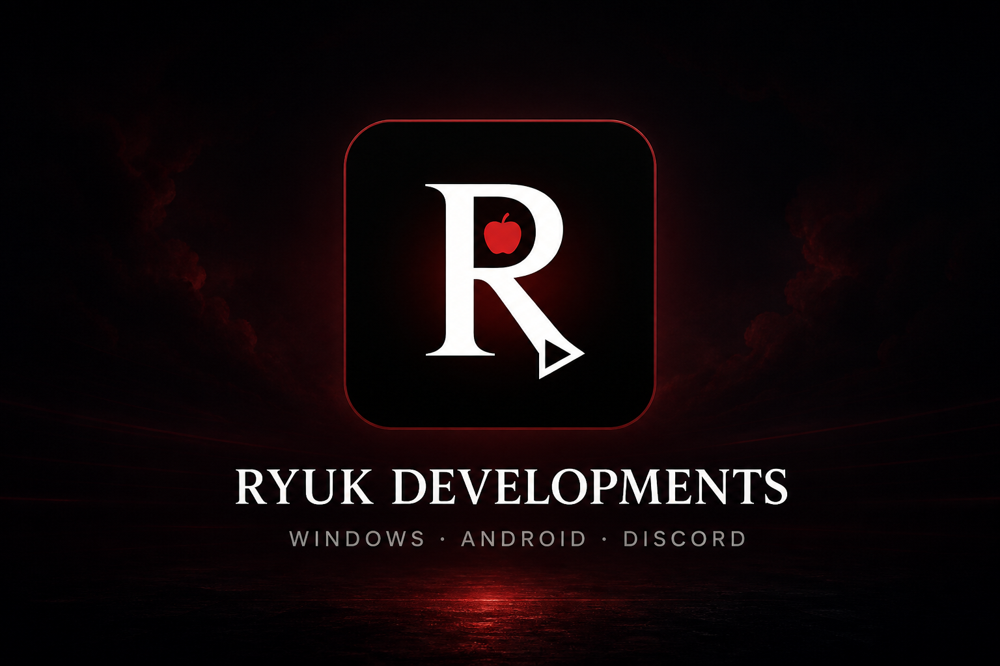
</p>

<h1 align="center">🍎 Ryuk Developments</h1>

<p align="center">
  <strong>Windows apps · Android apps · Discord bots · dashboards</strong><br/>
  Built, shipped, and maintained by <strong>Heema Star (Ryuk)</strong>
</p>

<p align="center">
  <a href="https://github.com/heema2/Ryuk-Dev"></a>
  <a href="https://discord.com/users/198843596558958601"></a>
  <a href="https://www.aqua-bot.xyz"></a>
</p>

<p align="center">
  
  
  
  
</p>

---

> **📌 GitHub profile + studio**  
> This is my public profile. The full product hub is **[Ryuk-Dev](https://github.com/heema2/Ryuk-Dev)** — every app, installer, and repo lives there.  
> **Source code is not published.**

---

## 👋 About me

I'm **Heema Star (Ryuk)** — independent developer behind **Ryuk Developments** (Egypt).

I design and ship complete products, not just prototypes:

- 🖥️ **Windows desktop apps** (.NET 8, WPF, installers, tray apps, auto-update)
- 📱 **Android apps** (Kotlin, Jetpack Compose, Material 3, offline-first)
- 💧 **Discord bots** with full **web dashboards** (Node.js, Discord.js, Next.js)
- 🛠️ **Private-server / GM tools**, dashboards, and custom community bots

📍 Egypt · 💬 [Discord](https://discord.com/users/198843596558958601) · 🏠 [Ryuk-Dev](https://github.com/heema2/Ryuk-Dev)

---

## 🚀 What I build

| I can create | Examples in this studio |
|---|---|
| Native **Windows** utilities and media apps | Ryuk Booster, Ryuk Player, Azan Desktop |
| **Android** consumer apps | Ryuk Reminder |
| Production **Discord bots** + dashboards | Aqua Bot |
| Game-server **GM / ops tools** | Ryuk GM Helper, Ryuk Dashboard |
| Installers, branding, update channels | Inno Setup, GitHub Releases |

```text
.NET 8  ·  WPF  ·  Kotlin  ·  Jetpack Compose  ·  Node.js  ·  Discord.js  ·  Next.js  ·  React
```

---

## 📦 Official products

Every product has a **public repo** (info + installer only — no source).

| | Product | Platform | Repo | Latest download |
|---|---|---|---|---|
| 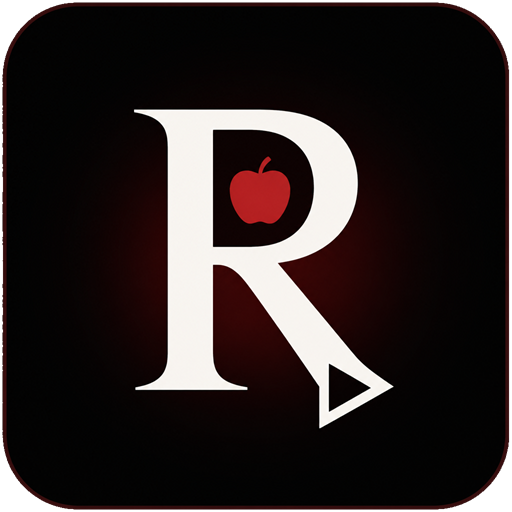 | **Ryuk Booster** | Windows 10 / 11 | [heema2/RyukBooster](https://github.com/heema2/RyukBooster) | [Installer](https://github.com/heema2/RyukBooster/releases/latest) |
|  | **Ryuk Player** | Windows 10 / 11 | [heema2/RyukPlayer](https://github.com/heema2/RyukPlayer) | [Installer](https://github.com/heema2/RyukPlayer/releases/latest) |
|  | **Azan Desktop** | Windows 10 / 11 | [heema2/Azan-Desktop](https://github.com/heema2/Azan-Desktop) | [Installer](https://github.com/heema2/Azan-Desktop/releases/latest) |
|  | **Ryuk GM Helper** | Windows 10 / 11 | [heema2/RyukGMHelper](https://github.com/heema2/RyukGMHelper) | [Installer](https://github.com/heema2/RyukGMHelper/releases/latest) |
| 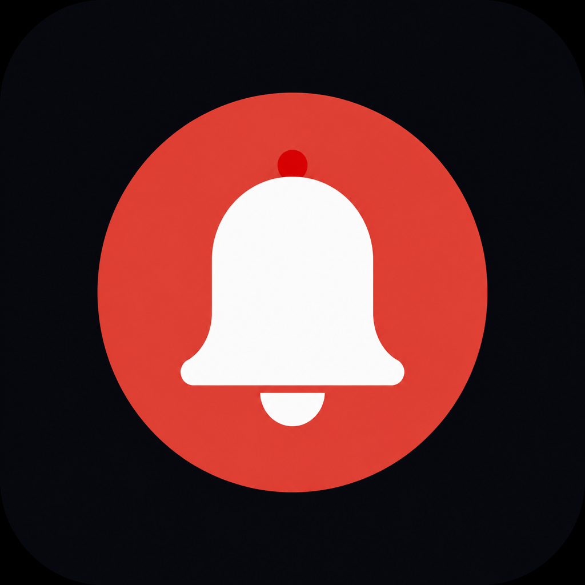 | **Ryuk Reminder** | Android | [heema2/RyukReminder](https://github.com/heema2/RyukReminder) | [APK](https://github.com/heema2/RyukReminder/releases/latest) |
| 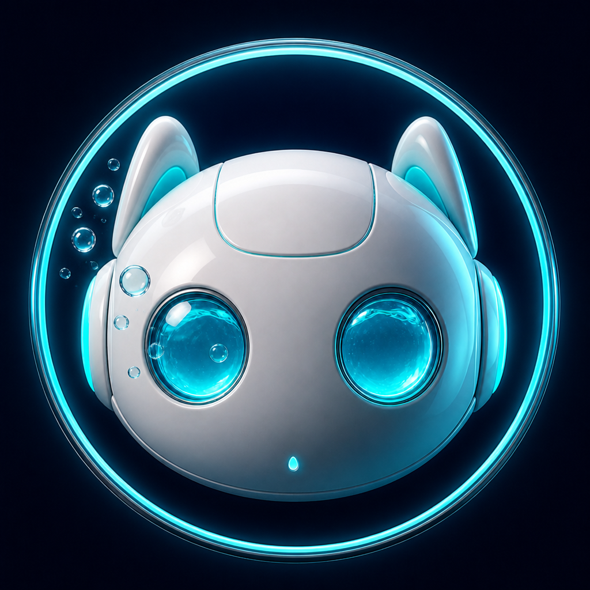 | **Aqua Bot** | Discord + Web | [heema2/Aqua-Bot](https://github.com/heema2/Aqua-Bot) | [Invite](https://discord.com/oauth2/authorize?client_id=1512880652461150289&permissions=1099914800214&scope=bot%20applications.commands) |

---

## 🖼️ Gallery

<p align="center">
  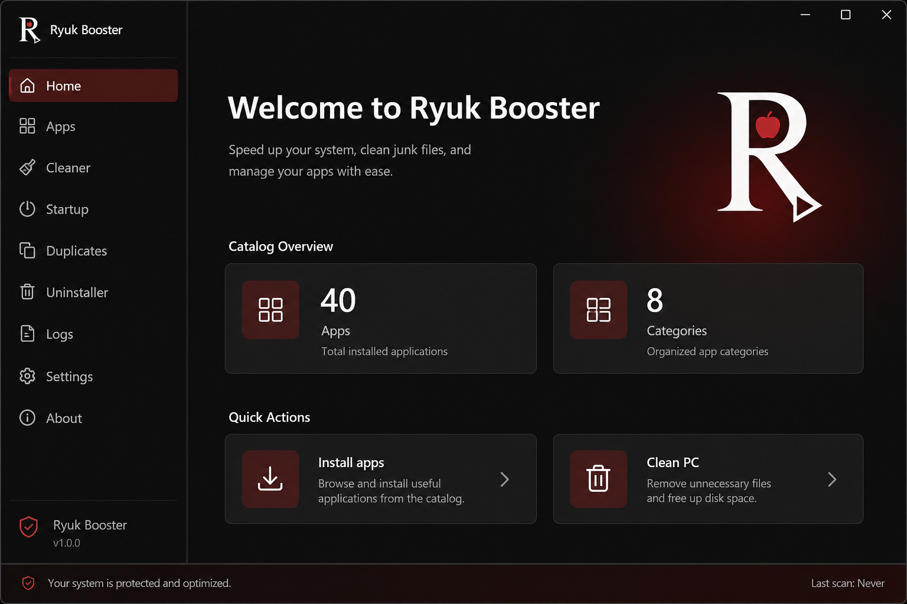
  &nbsp;
  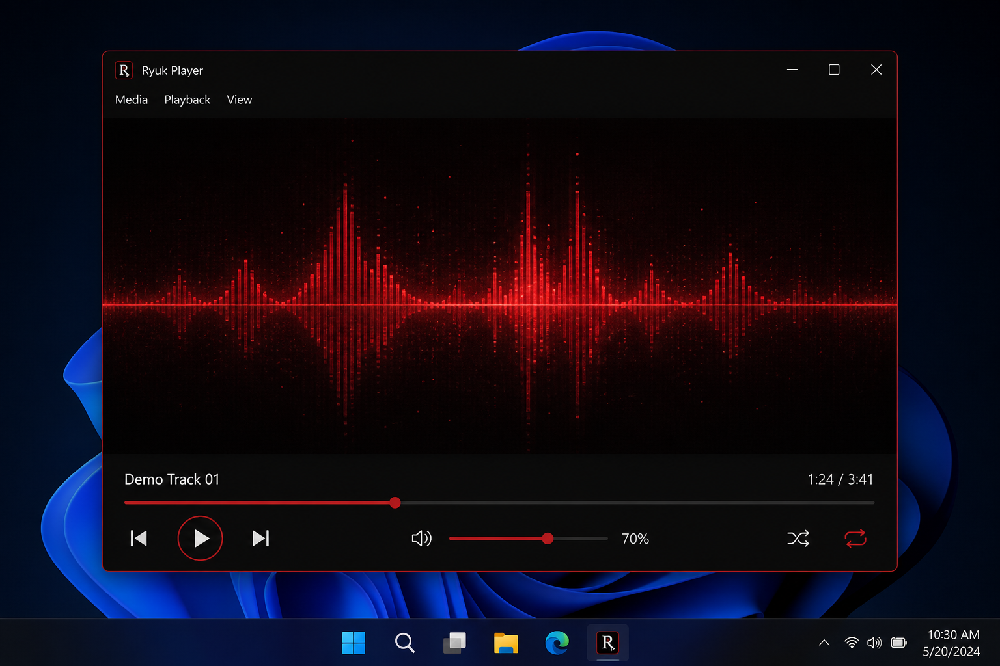
</p>
<p align="center">
  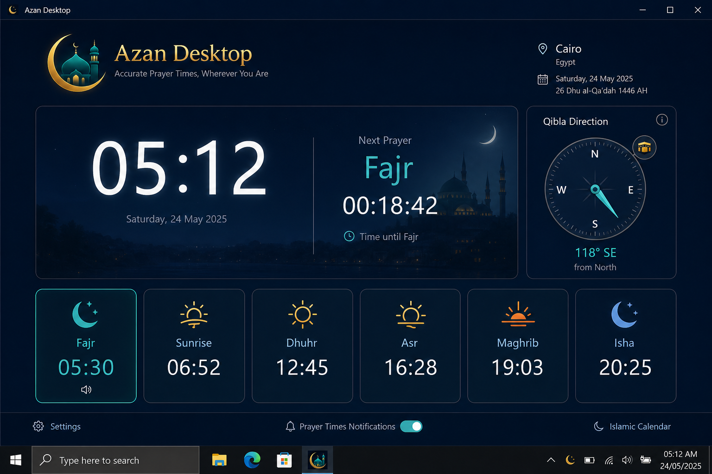
  &nbsp;
  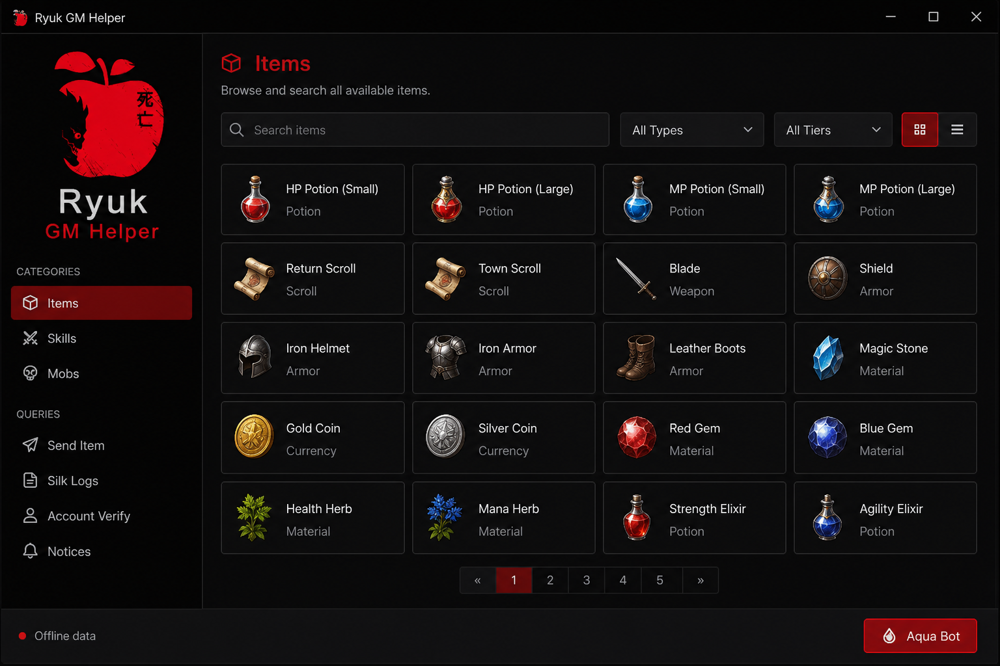
</p>
<p align="center">
  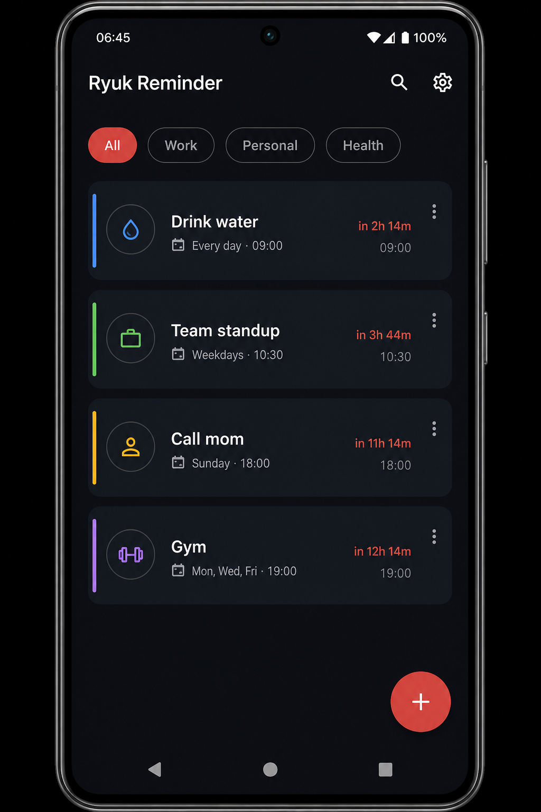
  &nbsp;
  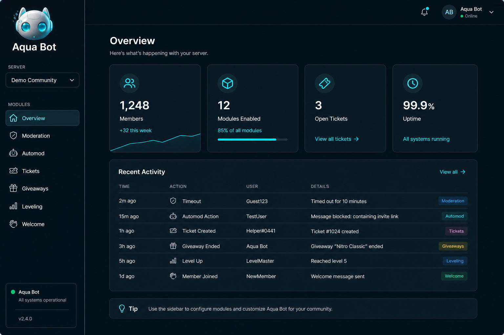
</p>

---

### 🧹 Ryuk Booster — Windows setup booster

Dark-themed Windows utility for **Windows 10 & 11**: curated app catalog with silent installs, junk cleaner, startup manager, duplicate finder, and auto-updates.

➡️ **Repo:** [github.com/heema2/RyukBooster](https://github.com/heema2/RyukBooster)

### 🎵 Ryuk Player — Windows media player

Music and video player with a dark Ryuk UI, visualizer, equalizer, playlist, tray icon, and a single-file Windows installer.

➡️ **Repo:** [github.com/heema2/RyukPlayer](https://github.com/heema2/RyukPlayer)

### 🕌 Azan Desktop — prayer times for Windows

Islamic prayer times, Azan audio, Qibla compass, tray countdown, offline fallback, and optional mute-other-apps during Azan.

➡️ **Repo:** [github.com/heema2/Azan-Desktop](https://github.com/heema2/Azan-Desktop)

### 🎮 Ryuk GM Helper — private-server GM toolkit

English Windows GM helper for Silkroad Online private servers: item/code browser, query builder, notice composer, offline data.

➡️ **Repo:** [github.com/heema2/RyukGMHelper](https://github.com/heema2/RyukGMHelper)

### ⏰ Ryuk Reminder — Android

Offline-first reminder app (Kotlin + Compose): one-time & recurring alarms, categories, snooze, themes. No internet permission.

➡️ **Repo:** [github.com/heema2/RyukReminder](https://github.com/heema2/RyukReminder)

### 💧 Aqua Bot — Discord bot + web dashboard

All-in-one Discord management bot with **25+ modules** and a modern Next.js dashboard: moderation, automod, tickets, giveaways, leveling, stream alerts, and more.

➡️ **Repo:** [github.com/heema2/Aqua-Bot](https://github.com/heema2/Aqua-Bot) · 🌐 [aqua-bot.xyz](https://www.aqua-bot.xyz)

<p align="center">
  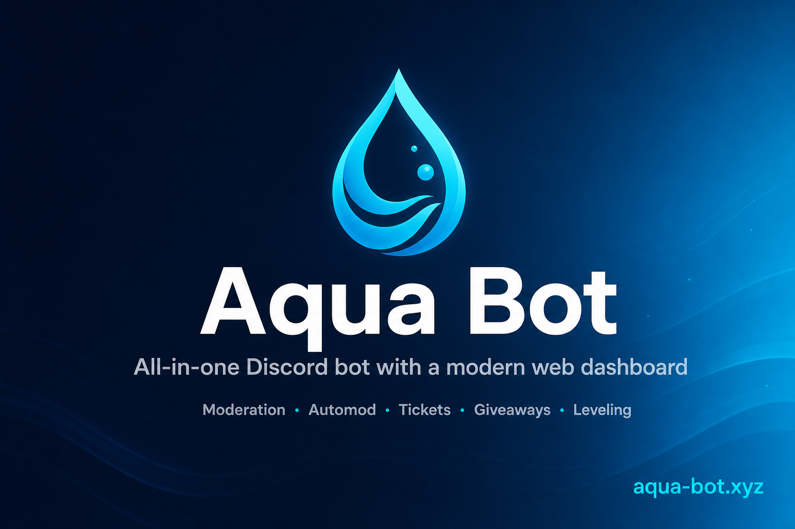
</p>

---

## 📌 Studio hub

The dedicated product hub (same showcase, plus notices and installers):

**[github.com/heema2/Ryuk-Dev](https://github.com/heema2/Ryuk-Dev)**

[](https://github.com/heema2/Ryuk-Dev)

---

## 🔗 Find me

| | |
|---|---|
| 🏠 **Studio hub** | [github.com/heema2/Ryuk-Dev](https://github.com/heema2/Ryuk-Dev) |
| 🐙 **This profile** | [github.com/heema2](https://github.com/heema2) |
| 💬 **Discord** | [discord.com/users/198843596558958601](https://discord.com/users/198843596558958601) |
| 💧 **Aqua Bot website** | [aqua-bot.xyz](https://www.aqua-bot.xyz) |
| 🛟 **Aqua support server** | [discord.gg/kKaSX5QJwa](https://discord.gg/kKaSX5QJwa) |
| ✉️ **Email** | [aqua-bot@outlook.com](mailto:aqua-bot@outlook.com) |

---

<p align="center">
  
</p>

<p align="center">
  <strong>© 2026 Ryuk Developments · All rights reserved</strong><br/>
  Source code is proprietary. Official installers only from the repos linked above.<br/>
  <a href="https://github.com/heema2/Ryuk-Dev">Ryuk-Dev</a> ·
  <a href="https://discord.com/users/198843596558958601">Discord</a> ·
  <a href="https://www.aqua-bot.xyz">Aqua Bot</a>
</p>
